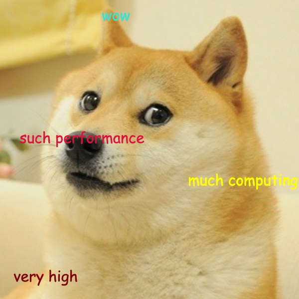

class: center

### Intro to High-Performance Computing Cluster
#### for UCL users



#### Albert Henry

.small75[
This presentation is available on: [https://alhenry.github.io/hpc-tutorial](https://alhenry.github.io/hpc-tutorial)

Source code: [https://github.com/alhenry/hpc-tutorial](https://github.com/alhenry/hpc-tutorial)
]

```{r setup, include=FALSE}
options(htmltools.dir.version = FALSE)
```

```{r xaringan-themer, include = FALSE}
library(xaringanthemer)

mono_accent(
  base_color = "#01223F",
  header_font_google = google_font("Raleway"),
  text_font_google   = google_font("Lato", "400", "400i"),
  code_font_google   = google_font("Droid Mono"),
  text_font_size = "24px",
  header_font_weight = "bolder",
  code_font_size = "0.5em",
  table_row_even_background_color = "#F0F0F0",
)

extra_css <- list(
  ".shadow" = list("text-shadow" = "0 0 10px #000"),
  ".blue2" = list(color = "#36BDF2"),
  ".blue3" = list(color = "#00F2F5"),
  ".gray" = list(color = "lightgray"),
  ".red"   = list(color = "firebrick", opaciy = "1"),
  ".blue" = list(color = "steelblue", opaciy = "1"),
  ".orange" = list(color = "orange", opaciy = "1"),
  ".green" = list(color = "seagreen", opacity = "1"),
  ".violet" = list(color = "darkorchid", opaciy = "1"),
  ".large125" = list("font-size" = "125%"),
  ".large150" = list("font-size" = "150%"),
  ".large200" = list("font-size" = "200%"),
  ".large300" = list("font-size" = "300%"),
  ".small75" = list("font-size" = "75%"),
  ".small50" = list("font-size" = "50%"),
  ".translucent" = list("opacity" = "0.4"),
  ".full-width" = list(
    display = "flex",
    width   = "100%",
    flex    = "1 1 auto"
  ),
  ".remark-slide-number" = list("opacity" = "0")
)

style_extra_css(extra_css)
```

---
# What is an HPC system?

A stand-alone resource for computationally intensive workloads, typically comprised of a multitude of independent processing and storage elements, designed to handle high volumes of data and/or large numbers of floating-point operations (FLOPS) with the highest possible performance (_UCL RITS_).


<iframe src="https://slides.com/johanneskoester/snakemake-tutorial/embed" width="576" height="420" scrolling="no" frameborder="0" webkitallowfullscreen mozallowfullscreen allowfullscreen></iframe>


